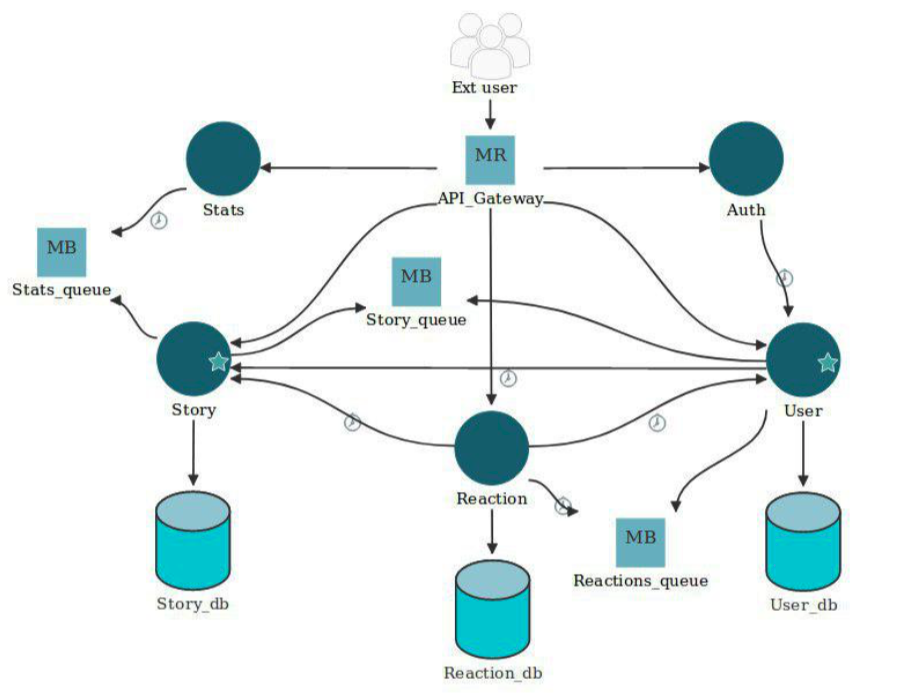

# Storytellers with microservices
Storytellers project with a Microservice architecture

The project is composed by the following services:

- auth
- users
- reactions
- story
- statistics/search



# Clone the repo

Clone:

```
git clone https://github.com/giobart/storytellers-microservices
git submodule update --init --recursive
```

Pull changes:

```
git submodule update --init --recursive
```
# Deploy the services

```
docker-compose up
```

Frontend is accessible at `localhost:8080`. Raw API Gateway accessible at `localhost:8081`.

# Status

Service | Build | Coverage |
--- | --- | --- |
Auth | [](https://travis-ci.org/giobart/storytellers-auth-service) | [](https://coveralls.io/github/giobart/storytellers-auth-service?branch=master)
Reaction | [](https://travis-ci.org/laurab1/reactions-microservice?branch=master) | [](https://coveralls.io/github/laurab1/Storytellers-Reactions?branch=master)
Statistics | [](https://travis-ci.org/deRemo/stats-microservice) | [](https://coveralls.io/github/deRemo/stats-microservice?branch=master)
Stories | [](https://travis-ci.com/alessandrodgr/stories-microservice) | [](https://coveralls.io/github/alessandrodgr/stories-microservice?branch=master)
Users | [](https://travis-ci.com/cardiamc/user-microservice) | [](https://coveralls.io/github/cardiamc/user-microservice?branch=master)
